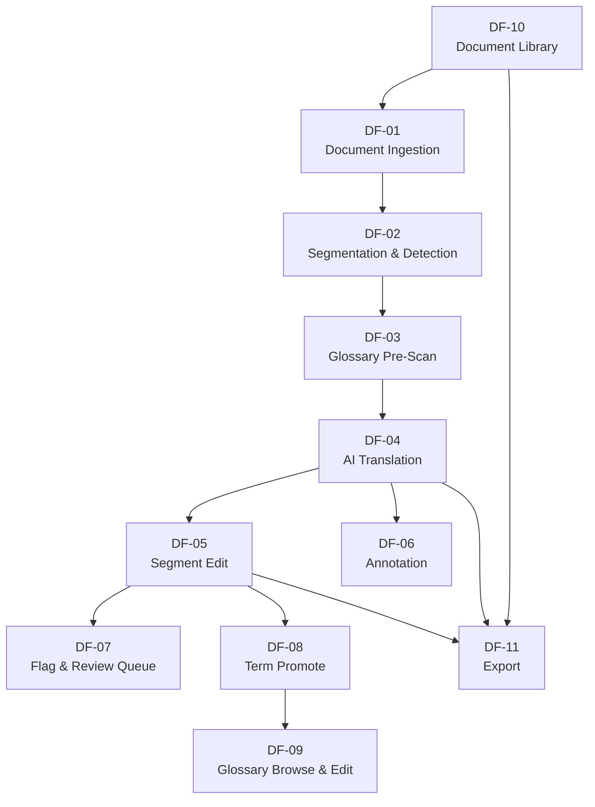

# ClassiMed Translate — Business Analysis

| Field | Value |
|---|---|
| Document type | Business Analysis |
| Version | 1.0 |
| Date | May 2026 |
| Application | ClassiMed Translate — Classical TCM Text Translation & Study Tool |

---

## 1. Dataflow Inventory

The application contains eleven dataflows grouped across five functional zones.

| ID | Name | Zone | Trigger |
|---|---|---|---|
| DF-01 | Document Ingestion | Ingestion / OCR | User imports a new text |
| DF-02 | Segmentation & Language Detection | Ingestion / OCR | After raw text is confirmed |
| DF-03 | Glossary Pre-Scan | Document Workspace | After segments are created |
| DF-04 | AI Translation | Document Workspace | Initiated by user after pre-scan |
| DF-05 | Segment Edit | Document Workspace | User clicks a cell in column B or C |
| DF-06 | Annotation | Document Workspace | User opens the notes column |
| DF-07 | Flag & Review Queue | Document Workspace | User flags a segment |
| DF-08 | Glossary Term Promote | Document Workspace | User promotes an in-text term |
| DF-09 | Glossary Browse & Edit | Glossary | User navigates to the glossary |
| DF-10 | Document Library Browse | Document Library | User opens the library |
| DF-11 | Export | Export | User initiates export |

---

## 2. Dataflow Details

---

### DF-01 — Document Ingestion

**Purpose:** Bring raw source text into the system from any of three entry points: pasted text, uploaded PDF, or photographed / scanned image.

#### Input data

| Field | Type | Source |
|---|---|---|
| `ingestMode` | `"paste" \| "pdf" \| "image"` | User selection |
| `rawText` | `string` | Paste input or clipboard |
| `uploadedFile` | `File` | File picker (PDF or image) |
| `documentMetadata` | `{ title, titleFr, period, type }` | User-supplied form fields |

#### Output data

| Field | Type | Destination |
|---|---|---|
| `document` | `Document` | `documents` table |
| `extractedText` | `string` | Passed to DF-02 |
| `ocrConfidence` | `number [0–1]` | Displayed to user for review |
| `ocrCorrectedText` | `string` | User may edit before confirming |

#### UI interactions

1. **Mode selector** — three tabs: Paste · PDF · Image. Switches the active input area.
2. **Paste area** — large `<textarea>` supporting CJK input. Character count shown live.
3. **File upload zone** — drag-and-drop or click. Shows filename and file size after selection.
4. **OCR progress bar** — visible during OCR processing; shows confidence score on completion.
5. **Correction view** — side-by-side display of extracted text with editable overlay; low-confidence characters highlighted.
6. **Metadata form** — inline fields for title, French title, historical period, and document type.
7. **Confirm button** — disabled until text is non-empty and title is set.

#### Atoms

| Atom | Kind | Type | Description |
|---|---|---|---|
| `ingestModeAtom` | Input | `"paste" \| "pdf" \| "image"` | Active ingestion tab |
| `pastedTextAtom` | Input | `string` | Raw text typed or pasted |
| `uploadedFileAtom` | Input | `File \| null` | File selected by the user |
| `metadataFormAtom` | Input | `Partial<InsertDocument>` | Draft document metadata |
| `ocrStatusAtom` | Output | `"idle" \| "running" \| "done" \| "error"` | OCR pipeline state |
| `ocrConfidenceAtom` | Output | `number` | Confidence score from OCR |
| `extractedTextAtom` | Output | `string` | Text produced by OCR or paste |
| `correctedTextAtom` | Input/Output | `string` | User-editable overlay over OCR output |
| `isIngestReadyAtom` | Transformation | `boolean` | Derived: `correctedText.length > 0 && title !== ""` |
| `charCountAtom` | Transformation | `number` | Derived: `correctedText.length` |
| `hasLowConfidenceSpansAtom` | Transformation | `boolean` | Derived: `ocrConfidence < 0.85` |

#### Effect services

| Service | Operation | Signature |
|---|---|---|
| `OcrService` | `run(file: File)` | `Effect<OcrResult, OcrError>` |
| `DocumentRepository` | `create(doc: InsertDocument)` | `Effect<Document, DbError>` |

---

### DF-02 — Segmentation & Language Detection

**Purpose:** Split the confirmed raw text into individual clauses and assign a language variety badge (`classical`, `modern`, `french`) to each with a confidence score.

#### Input data

| Field | Type | Source |
|---|---|---|
| `documentId` | `string` | Created in DF-01 |
| `rawText` | `string` | Confirmed text from DF-01 |

#### Output data

| Field | Type | Destination |
|---|---|---|
| `segments[]` | `Segment[]` | `segments` table |
| `langDistribution` | `{ classical: n, modern: n, french: n }` | Progress indicator |
| `mixedSegmentIds` | `string[]` | Flagged for user splitting |

#### UI interactions

1. **Segmentation preview** — text rendered as a stacked list of detected clauses with separating rules.
2. **Language badge** — coloured pill on each segment: 🔵 Classical / 🟢 Modern / 🟡 French.
3. **Badge override control** — dropdown on each badge; user may reassign language.
4. **Mixed-segment warning** — banner above mixed segments with a "Split interactively" action.
5. **Segment split tool** — click within source text to set a split point; two new segments replace the original.
6. **Confidence indicator** — small opacity decrease on low-confidence segments (< 0.9).
7. **"Begin translation" button** — enabled only after user has reviewed detection; proceeds to DF-03 and DF-04.

#### Atoms

| Atom | Kind | Type | Description |
|---|---|---|---|
| `rawTextAtom` | Input | `string` | Text passed from DF-01 |
| `segmentationStatusAtom` | Output | `"idle" \| "running" \| "done"` | Pipeline state |
| `pendingSegmentsAtom` | Output | `Segment[]` | Detected segments before user confirmation |
| `overriddenLangsAtom` | Input | `Map<string, SegmentLang>` | User-provided language overrides |
| `splitRequestAtom` | Input | `{ segmentId: string; splitOffset: number } \| null` | Active split operation |
| `confirmedSegmentsAtom` | Transformation | `Segment[]` | Derived: `pendingSegments` with `overriddenLangs` applied |
| `langDistributionAtom` | Transformation | `Record<SegmentLang, number>` | Derived: count per language variety |
| `mixedSegmentIdsAtom` | Transformation | `string[]` | Derived: segments flagged as needing split |
| `isDetectionConfirmedAtom` | Transformation | `boolean` | Derived: no mixed segments remain |

#### Effect services

| Service | Operation | Signature |
|---|---|---|
| `SegmentationService` | `split(text: string)` | `Effect<RawSegment[], SegmentError>` |
| `LanguageDetectionService` | `classify(segments: RawSegment[])` | `Effect<Segment[], DetectionError>` |
| `SegmentRepository` | `createBatch(segs: InsertSegment[])` | `Effect<Segment[], DbError>` |

---

### DF-03 — Glossary Pre-Scan

**Purpose:** Before translation runs, scan all segments against the glossary to highlight known TCM terms. Load glossary constraints so the translation step can enforce conventions.

#### Input data

| Field | Type | Source |
|---|---|---|
| `segments[]` | `Segment[]` | Output of DF-02 |
| `glossaryTerms[]` | `GlossaryTerm[]` | `glossary_terms` table |

#### Output data

| Field | Type | Destination |
|---|---|---|
| `termOccurrences[]` | `TermOccurrence[]` | `term_occurrences` table |
| `glossaryConstraints` | `Map<string, GlossaryTerm>` | Passed to DF-04 |
| `highlightedSegments` | `SegmentWithSpans[]` | Workspace column A rendering |

#### UI interactions

1. **Term highlights in column A** — recognised characters underlined with a thin accent colour.
2. **Term tooltip on hover** — shows: Chinese characters · pinyin · category badge · primary French rendering.
3. **"Open in glossary" link** in tooltip — opens the full glossary panel for that term (DF-09).
4. **Pre-scan summary bar** — shows count of recognised terms and segments containing at least one term.
5. **Terms light up before translation** — deliberate visual rhythm: user can inspect the vocabulary structure before committing to translation.

#### Atoms

| Atom | Kind | Type | Description |
|---|---|---|---|
| `activeDocumentIdAtom` | Input | `string` | Currently open document |
| `loadedSegmentsAtom` | Input | `Segment[]` | Segments of the active document |
| `allGlossaryTermsAtom` | Input | `GlossaryTerm[]` | Full glossary loaded from DB |
| `hoveredTermAtom` | Input | `GlossaryTerm \| null` | Term under the mouse cursor |
| `termOccurrencesAtom` | Output | `TermOccurrence[]` | Persisted scan results |
| `termHighlightMapAtom` | Transformation | `Map<segmentId, TermSpan[]>` | Derived: character spans per segment |
| `glossaryConstraintsAtom` | Transformation | `Map<termId, GlossaryTerm>` | Derived: id-indexed lookup for DF-04 |
| `preScanSummaryAtom` | Transformation | `{ termCount: number; segmentsWithTerms: number }` | Derived: summary stats |

#### Effect services

| Service | Operation | Signature |
|---|---|---|
| `GlossaryRepository` | `listAll()` | `Effect<GlossaryTerm[], DbError>` |
| `TermScanService` | `scan(segments, terms)` | `Effect<TermOccurrence[], never>` |
| `TermOccurrenceRepository` | `createBatch(occs)` | `Effect<TermOccurrence[], DbError>` |

---

### DF-04 — AI Translation

**Purpose:** Translate each untranslated segment through a two-hop pipeline: Classical Chinese → Modern Chinese paraphrase (column B), then → French translation (column C). Modern-Chinese segments skip the first hop.

#### Input data

| Field | Type | Source |
|---|---|---|
| `segments[]` | `Segment[]` | Segments with `glossText` or `frText` null |
| `glossaryConstraints` | `Map<termId, GlossaryTerm>` | From DF-03 |
| `userLang` | `"fr"` | Application setting |

#### Output data

| Field | Type | Destination |
|---|---|---|
| `glossText` per segment | `string` | `segments.gloss_text` |
| `frText` per segment | `string` | `segments.fr_text` |
| `termConflicts[]` | `TermOccurrence[]` with `hasConflict = true` | `term_occurrences.has_conflict` |

#### UI interactions

1. **Translation progress bar** — per-document progress: `done / total` segments.
2. **Streaming cell fill** — column B and C cells fill word-by-word as results stream.
3. **Skeleton placeholders** — untranslated cells show a subtle shimmer while waiting in queue.
4. **Re-translate action** — segment action menu item; re-runs AI for a single segment.
5. **Conflict warning icon** — small amber icon on column C cells where a term rendering differs from the glossary convention; non-blocking.
6. **Translation queue sidebar** — collapsible list showing pending / in-progress / done segments.

#### Atoms

| Atom | Kind | Type | Description |
|---|---|---|---|
| `translationQueueAtom` | Input/Output | `{ pending: string[]; running: string \| null; done: string[] }` | Segment IDs by state |
| `glossaryConstraintsAtom` | Input | `Map<termId, GlossaryTerm>` | From DF-03 |
| `streamingResultsAtom` | Output | `Map<segmentId, { gloss: string; fr: string }>` | Partial results during streaming |
| `translationProgressAtom` | Transformation | `{ done: number; total: number; pct: number }` | Derived: progress fraction |
| `conflictWarningsAtom` | Transformation | `Map<segmentId, ConflictWarning[]>` | Derived: per-segment conflicts from occurrences |
| `hasUnresolvedConflictsAtom` | Transformation | `boolean` | Derived: any `hasConflict === true` occurrence |

#### Effect services

| Service | Operation | Signature |
|---|---|---|
| `TranslationService` | `translateSegment(seg, constraints)` | `Effect<{ gloss: string; fr: string }, TranslationError>` |
| `TranslationService` | `stream(seg, constraints)` | `Stream<TranslationChunk, TranslationError>` |
| `SegmentRepository` | `updateTranslation(id, gloss, fr)` | `Effect<Segment, DbError>` |
| `ConflictDetectionService` | `check(frText, occurrences, terms)` | `Effect<ConflictWarning[], never>` |
| `TermOccurrenceRepository` | `setConflicts(ids, flag)` | `Effect<void, DbError>` |

---

### DF-05 — Segment Edit

**Purpose:** Allow the user to correct AI-generated content in column B (modern gloss) or column C (French translation) and persist the change. Conflict warnings re-evaluated on each save.

#### Input data

| Field | Type | Source |
|---|---|---|
| `segmentId` | `string` | User click on a cell |
| `editedGlossText` | `string \| null` | User input in column B |
| `editedFrText` | `string \| null` | User input in column C |

#### Output data

| Field | Type | Destination |
|---|---|---|
| `updatedSegment` | `Segment` | `segments` table |
| `updatedConflicts` | `TermOccurrence[]` | `term_occurrences.has_conflict` re-evaluated |

#### UI interactions

1. **Click-to-edit** — clicking column B or C cells switches them to an inline `<textarea>`.
2. **Auto-resize textarea** — expands vertically with content; never scrolls internally.
3. **Save on blur / Cmd+Enter** — leaving the cell or pressing the keyboard shortcut triggers save.
4. **Unsaved changes indicator** — subtle left border accent while a cell has unconfirmed edits.
5. **Conflict re-evaluation** — after save, conflict warnings update in place without a full re-render.
6. **Revert action** — "↩ Revert" link in cell restores the last AI-generated value.
7. **Merge with next / Split segment** — available in the segment action menu.

#### Atoms

| Atom | Kind | Type | Description |
|---|---|---|---|
| `editingSegmentIdAtom` | Input | `string \| null` | Which segment cell is active |
| `editingColumnAtom` | Input | `"gloss" \| "fr" \| null` | Which column is being edited |
| `editGlossTextAtom` | Input | `string` | Draft content for column B |
| `editFrTextAtom` | Input | `string` | Draft content for column C |
| `savedSegmentAtom` | Output | `Segment \| null` | Last persisted segment |
| `hasUnsavedChangesAtom` | Transformation | `boolean` | Derived: draft differs from persisted value |
| `editConflictWarningsAtom` | Transformation | `ConflictWarning[]` | Derived: live conflict check as user types |

#### Effect services

| Service | Operation | Signature |
|---|---|---|
| `SegmentRepository` | `update(id, patch)` | `Effect<Segment, DbError>` |
| `ConflictDetectionService` | `check(frText, occurrences, terms)` | `Effect<ConflictWarning[], never>` |
| `TermOccurrenceRepository` | `setConflicts(ids, flag)` | `Effect<void, DbError>` |

---

### DF-06 — Annotation

**Purpose:** Attach free-text margin notes to individual segments for cross-referencing, bibliographic notes, and personal commentary.

#### Input data

| Field | Type | Source |
|---|---|---|
| `segmentId` | `string` | Segment action menu |
| `annotationText` | `string` | User input |

#### Output data

| Field | Type | Destination |
|---|---|---|
| `annotation` | `Annotation` | `annotations` table |

#### UI interactions

1. **Notes column (column D)** — narrow fourth column; shows note count badge per segment.
2. **Click to open note panel** — clicking the badge expands an inline note editor below the segment row.
3. **Note editor** — plain text `<textarea>` with live character count; Cmd+Enter to save.
4. **Note list** — multiple notes per segment displayed in chronological order.
5. **Delete note** — hover reveals a small ✕ button.

#### Atoms

| Atom | Kind | Type | Description |
|---|---|---|---|
| `activeAnnotationSegmentIdAtom` | Input | `string \| null` | Segment whose notes panel is open |
| `annotationDraftAtom` | Input | `string` | Draft text in the note editor |
| `segmentAnnotationsAtom` | Output | `Map<segmentId, Annotation[]>` | All annotations for the active document |
| `noteCountPerSegmentAtom` | Transformation | `Map<segmentId, number>` | Derived: count for badges |

#### Effect services

| Service | Operation | Signature |
|---|---|---|
| `AnnotationRepository` | `create(ann: InsertAnnotation)` | `Effect<Annotation, DbError>` |
| `AnnotationRepository` | `delete(id: string)` | `Effect<void, DbError>` |
| `AnnotationRepository` | `listByDocument(docId)` | `Effect<Annotation[], DbError>` |

---

### DF-07 — Flag & Review Queue

**Purpose:** Mark segments that require follow-up (ambiguous translations, OCR errors, terminology debates). Maintain a cross-document review queue.

#### Input data

| Field | Type | Source |
|---|---|---|
| `segmentId` | `string` | Segment action menu |
| `documentId` | `string` | Active document |
| `flagReason` | `string` | Optional user note |

#### Output data

| Field | Type | Destination |
|---|---|---|
| `reviewQueueItem` | `ReviewQueueItem` | `review_queue` table |
| `updatedSegment` | `Segment` with `isFlagged = true` | `segments` table |

#### UI interactions

1. **Flag action** — in the segment action menu; opens a small popover for optional reason text.
2. **Flag badge** — segment row gains a coloured left border and a small flag icon.
3. **Review queue sidebar** — accessible from the main navigation; shows all open items grouped by document.
4. **Queue item card** — shows segment text excerpt, document name, reason, and date.
5. **Resolve action** — "Mark resolved" button on each card; sets `resolvedAt` and removes from view.
6. **Queue count badge** — navigation icon shows the current open count.

#### Atoms

| Atom | Kind | Type | Description |
|---|---|---|---|
| `flaggingSegmentIdAtom` | Input | `string \| null` | Segment being flagged (popover open) |
| `flagReasonDraftAtom` | Input | `string` | Draft reason text |
| `reviewQueueAtom` | Output | `ReviewQueueItem[]` | All open queue items |
| `openQueueCountAtom` | Transformation | `number` | Derived: `filter(x => !x.resolvedAt).length` |
| `queueGroupedByDocAtom` | Transformation | `Map<documentId, ReviewQueueItem[]>` | Derived: grouped for sidebar |
| `flaggedSegmentIdsAtom` | Transformation | `Set<string>` | Derived: for fast row-level flag indicator |

#### Effect services

| Service | Operation | Signature |
|---|---|---|
| `ReviewQueueRepository` | `create(item: InsertReviewQueueItem)` | `Effect<ReviewQueueItem, DbError>` |
| `ReviewQueueRepository` | `resolve(id: string)` | `Effect<void, DbError>` |
| `ReviewQueueRepository` | `listOpen()` | `Effect<ReviewQueueItem[], DbError>` |
| `SegmentRepository` | `update(id, { isFlagged, flagReason })` | `Effect<Segment, DbError>` |

---

### DF-08 — Glossary Term Promote

**Purpose:** Allow the user to promote any Chinese character sequence encountered in context directly into the glossary as a new term entry, pre-filling fields from the current segment.

#### Input data

| Field | Type | Source |
|---|---|---|
| `selectedChars` | `string` | Text selection in column A |
| `segmentId` | `string` | Source segment |
| `suggestedFrRendering` | `string` | Detected rendering from column C |

#### Output data

| Field | Type | Destination |
|---|---|---|
| `newTerm` | `GlossaryTerm` | `glossary_terms` table |
| `frTranslation` | `TermFrTranslation` | `term_fr_translations` table |
| `termOccurrence` | `TermOccurrence` | `term_occurrences` table |

#### UI interactions

1. **Text selection in column A** — selecting characters shows a "Promote to glossary" tooltip action.
2. **Promote drawer** — slides in from the right; pre-filled with selected characters, inferred pinyin, and suggested French rendering.
3. **Category picker** — segmented control: concept / meridian / point / pathology / technique / herb / proper.
4. **Notes field** — optional free text for etymology or clinical context.
5. **Duplicate detection** — if the character string already exists in the glossary, shows an "Already in glossary — view entry?" link instead of a save button.
6. **One-click save** — minimal friction; feel like a reward (Design Brief §9).

#### Atoms

| Atom | Kind | Type | Description |
|---|---|---|---|
| `selectedCharsAtom` | Input | `string` | Characters selected in column A |
| `promoteSourceSegmentIdAtom` | Input | `string \| null` | Segment containing the selection |
| `promoteSuggestedFrAtom` | Input | `string` | FR rendering from column C at selection site |
| `promoteFormAtom` | Input | `Partial<InsertGlossaryTerm>` | Draft form in the promote drawer |
| `promotedTermAtom` | Output | `GlossaryTerm \| null` | Newly created term |
| `isDuplicateAtom` | Transformation | `boolean` | Derived: `allGlossaryTerms.some(t => t.char === selectedChars)` |
| `duplicateTermAtom` | Transformation | `GlossaryTerm \| null` | Derived: existing term with the same char |

#### Effect services

| Service | Operation | Signature |
|---|---|---|
| `GlossaryRepository` | `create(term: InsertGlossaryTerm)` | `Effect<GlossaryTerm, DbError>` |
| `TermFrTranslationRepository` | `create(tr: InsertTermFrTranslation)` | `Effect<TermFrTranslation, DbError>` |
| `TermOccurrenceRepository` | `create(occ: InsertTermOccurrence)` | `Effect<TermOccurrence, DbError>` |
| `PinyinService` | `infer(chars: string)` | `Effect<string, never>` |

---

### DF-09 — Glossary Browse & Edit

**Purpose:** Provide a full-page and slide-in panel view of the glossary, with filtering by category, search, and the ability to edit any term entry. Show all corpus occurrences of a selected term.

#### Input data

| Field | Type | Source |
|---|---|---|
| `searchQuery` | `string` | Search field |
| `categoryFilter` | `string \| null` | Category selector |
| `termId` (for edit) | `string` | Term card selection |
| `termPatch` | `Partial<GlossaryTerm>` | Edit form |

#### Output data

| Field | Type | Destination |
|---|---|---|
| `updatedTerm` | `GlossaryTerm` | `glossary_terms` table |
| `updatedFrTranslations` | `TermFrTranslation[]` | `term_fr_translations` table |
| `corpusOccurrences` | `TermOccurrence[]` with document + segment context | Display only |

#### UI interactions

1. **Search bar** — full-text search over `char`, `pinyin`, `frPrimary`, and `notes` fields; debounced.
2. **Category filter bar** — horizontal pill group; clicking a category filters the list. Multi-select allowed.
3. **Term card list** — each card shows: character(s) large, pinyin, category badge, primary French, note excerpt.
4. **Term detail panel** — click a card to expand a detail view with all FR translations, reference translations, and notes.
5. **Corpus occurrences panel** — within detail view; shows every passage where the term appears, with document name and a "Jump to segment" link.
6. **Edit mode** — "Edit" button on detail panel switches all fields to editable inputs.
7. **FR translation management** — add/remove/reorder FR renderings within the edit form.
8. **Delete term** — available in the edit form; shows a confirmation dialog.

#### Atoms

| Atom | Kind | Type | Description |
|---|---|---|---|
| `glossarySearchAtom` | Input | `string` | Live search query |
| `glossaryCategoryFilterAtom` | Input | `string[]` | Active category filters |
| `selectedTermIdAtom` | Input | `string \| null` | Term currently shown in detail panel |
| `termEditFormAtom` | Input | `Partial<GlossaryTerm> \| null` | Draft fields in edit mode |
| `isEditingTermAtom` | Input | `boolean` | Whether edit mode is active |
| `allGlossaryTermsAtom` | Output | `GlossaryTerm[]` | Full list from DB |
| `termFrTranslationsAtom` | Output | `Map<termId, TermFrTranslation[]>` | All FR renderings by term |
| `termReferencesAtom` | Output | `Map<termId, TermReference[]>` | All reference translations by term |
| `termCorpusOccurrencesAtom` | Output | `TermOccurrenceWithContext[]` | Occurrences of the selected term |
| `filteredGlossaryAtom` | Transformation | `GlossaryTerm[]` | Derived: search + category filter applied |
| `selectedTermAtom` | Transformation | `GlossaryTerm \| null` | Derived: `allTerms.find(t => t.id === selectedTermId)` |

#### Effect services

| Service | Operation | Signature |
|---|---|---|
| `GlossaryRepository` | `listAll()` | `Effect<GlossaryTerm[], DbError>` |
| `GlossaryRepository` | `update(id, patch)` | `Effect<GlossaryTerm, DbError>` |
| `GlossaryRepository` | `delete(id)` | `Effect<void, DbError>` |
| `TermFrTranslationRepository` | `listByTerm(termId)` | `Effect<TermFrTranslation[], DbError>` |
| `TermFrTranslationRepository` | `upsertAll(termId, trs)` | `Effect<TermFrTranslation[], DbError>` |
| `TermReferenceRepository` | `listByTerm(termId)` | `Effect<TermReference[], DbError>` |
| `TermOccurrenceRepository` | `listByTermWithContext(termId)` | `Effect<TermOccurrenceWithContext[], DbError>` |

---

### DF-10 — Document Library Browse

**Purpose:** Display all imported documents with their metadata and progress statistics. Support import, search, tag filtering, and deletion.

#### Input data

| Field | Type | Source |
|---|---|---|
| `searchQuery` | `string` | Library search bar |
| `typeFilter` | `string \| null` | Type selector (canon / manuscript / commentary) |
| `tagFilter` | `string[]` | Tag filter chips |
| `sortBy` | `"updatedAt" \| "title" \| "progress"` | Sort selector |

#### Output data

| Field | Type | Destination |
|---|---|---|
| `filteredDocuments` | `DocumentWithStats[]` | Library grid |
| `deletedDocument` | `void` | Cascade delete in DB |

#### UI interactions

1. **Document grid** — card grid; each card shows title (CJK), French title, period, type badge, tag list, and a progress arc (done / total segments).
2. **Search bar** — searches title, titleFr, period, tags.
3. **Type filter** — pill group above the grid.
4. **Tag cloud** — all tags across the corpus; click to add to filter.
5. **Sort control** — dropdown: by last updated / alphabetical / translation progress.
6. **Import button** — navigates to DF-01 ingestion flow.
7. **Document context menu** — right-click or "⋯" on a card: Open · Export · Archive · Delete.
8. **Delete confirmation dialog** — warns that all segments, annotations, and queue items will be removed.
9. **Queued status badge** — documents with `status = "queued"` show an "À importer" badge.

#### Atoms

| Atom | Kind | Type | Description |
|---|---|---|---|
| `librarySearchAtom` | Input | `string` | Search query |
| `libraryTypeFilterAtom` | Input | `string \| null` | Active type filter |
| `libraryTagFilterAtom` | Input | `string[]` | Active tag filters |
| `librarySortAtom` | Input | `"updatedAt" \| "title" \| "progress"` | Sort field |
| `allDocumentsAtom` | Output | `Document[]` | All documents from DB |
| `documentStatsAtom` | Output | `Map<docId, { total: number; done: number; flagged: number }>` | Segment stats per document |
| `allTagsAtom` | Transformation | `string[]` | Derived: deduplicated union of all document tags |
| `filteredDocumentsAtom` | Transformation | `DocumentWithStats[]` | Derived: search + type + tag filter + sort applied |
| `pendingDeleteIdAtom` | Input | `string \| null` | Document ID in deletion confirmation dialog |

#### Effect services

| Service | Operation | Signature |
|---|---|---|
| `DocumentRepository` | `listAll()` | `Effect<Document[], DbError>` |
| `DocumentRepository` | `delete(id)` | `Effect<void, DbError>` |
| `SegmentRepository` | `statsByDocument(docId)` | `Effect<SegmentStats, DbError>` |

---

### DF-11 — Export

**Purpose:** Produce a shareable, publication-ready output file from the translated document. The user selects format, column configuration, and previews the output before downloading.

#### Input data

| Field | Type | Source |
|---|---|---|
| `documentId` | `string` | Active document |
| `format` | `"pdf" \| "docx"` | Format selector |
| `columns` | `("src" \| "gloss" \| "fr" \| "notes")[]` | Column configuration |
| `includeGlossary` | `boolean` | Checkbox |
| `includeAnnotations` | `boolean` | Checkbox |

#### Output data

| Field | Type | Destination |
|---|---|---|
| `exportBlob` | `Blob` | Browser download |
| `exportSettings` | `ExportSettings` | Local settings (persisted for next use) |

#### UI interactions

1. **Export panel** — slide-in from the right; opens from the document workspace toolbar.
2. **Format selector** — two large toggle buttons: PDF · DOCX.
3. **Column configuration** — checkbox list with drag-to-reorder; preview updates live.
4. **Include options** — checkboxes for appended glossary and margin annotations.
5. **Preview pane** — rendered preview of the first two segments in the chosen configuration.
6. **Export button** — triggers generation; shows a progress spinner while the file is built.
7. **Download prompt** — browser `<a download>` triggered on blob ready.
8. **"Remember settings" notice** — settings are persisted silently; small confirmation toast on first use.

#### Atoms

| Atom | Kind | Type | Description |
|---|---|---|---|
| `exportDocumentIdAtom` | Input | `string \| null` | Document being exported |
| `exportFormatAtom` | Input | `"pdf" \| "docx"` | Selected output format |
| `exportColumnsAtom` | Input | `ExportColumn[]` | Ordered column selection |
| `exportIncludeGlossaryAtom` | Input | `boolean` | Whether to append glossary |
| `exportIncludeAnnotationsAtom` | Input | `boolean` | Whether to include notes |
| `exportStatusAtom` | Output | `"idle" \| "building" \| "ready" \| "error"` | Generation state |
| `exportBlobAtom` | Output | `Blob \| null` | Generated file |
| `exportPreviewAtom` | Transformation | `PreviewSegment[]` | Derived: first 2 segments with column config applied |
| `exportIsValidAtom` | Transformation | `boolean` | Derived: `exportColumns.length > 0 && documentId !== null` |

#### Effect services

| Service | Operation | Signature |
|---|---|---|
| `ExportService` | `build(docId, opts: ExportOptions)` | `Effect<Blob, ExportError>` |
| `ExportSettingsRepository` | `save(settings: ExportSettings)` | `Effect<void, DbError>` |
| `ExportSettingsRepository` | `load()` | `Effect<ExportSettings \| null, DbError>` |
| `DocumentRepository` | `getWithSegments(docId)` | `Effect<DocumentWithSegments, DbError>` |

---

## 3. Dataflow Dependency Map



---

## 4. Effect Service Catalogue

All services are Effect-TS services exposing an interface via `Context.Tag`. They handle all I/O; atoms hold derived read-only state only — no service calls happen inside atoms.

| Service | Concern |
|---|---|
| `OcrService` | Image / PDF to text via AI or third-party OCR API |
| `SegmentationService` | Rule-based and AI-assisted clause splitting |
| `LanguageDetectionService` | Per-segment Classical / Modern / French classification |
| `TranslationService` | Two-hop AI translation with glossary constraints |
| `ConflictDetectionService` | Pure function: compare rendered FR against glossary conventions |
| `PinyinService` | Infer pinyin romanisation from CJK input |
| `ExportService` | Render PDF / DOCX from document + segments + options |
| `DocumentRepository` | CRUD on `documents` table |
| `SegmentRepository` | CRUD + batch ops on `segments` table |
| `GlossaryRepository` | CRUD on `glossary_terms` table |
| `TermFrTranslationRepository` | CRUD on `term_fr_translations` table |
| `TermReferenceRepository` | Read on `term_references` table |
| `TermOccurrenceRepository` | CRUD on `term_occurrences` table |
| `AnnotationRepository` | CRUD on `annotations` table |
| `ReviewQueueRepository` | CRUD on `review_queue` table |
| `ExportSettingsRepository` | Persist / load last-used export settings |

---

## 5. Atom Taxonomy Summary

| Kind | Role | Update source |
|---|---|---|
| **Input atom** | Captures direct user intent or UI state | User interaction (click, type, select) |
| **Output atom** | Holds data returned from an Effect service | Loaded by an Effect after a service call resolves |
| **Transformation atom** | Derives a new value from other atoms | Recomputed synchronously whenever upstream atoms change |

Effect services are **never called from inside atoms**. The pattern is:

```
User interaction
  → writes to Input atom
  → triggers an Effect service call (in a React effect or event handler)
    → service call resolves / streams
      → writes to Output atom
        → Transformation atoms recompute
          → UI re-renders
```
