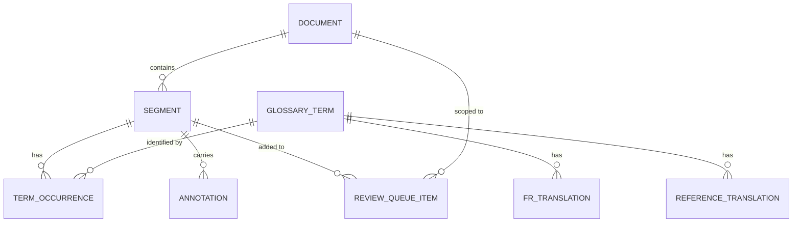
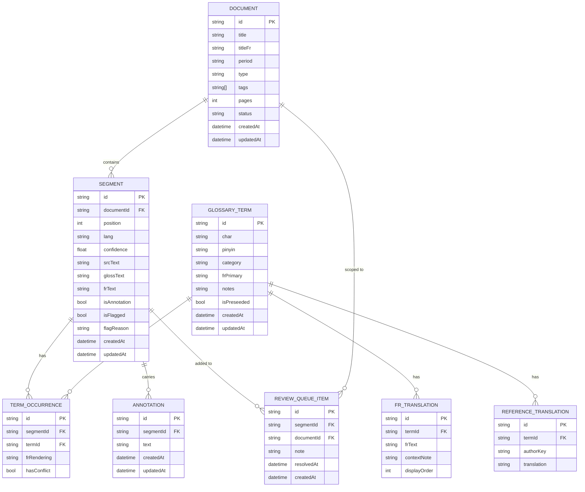
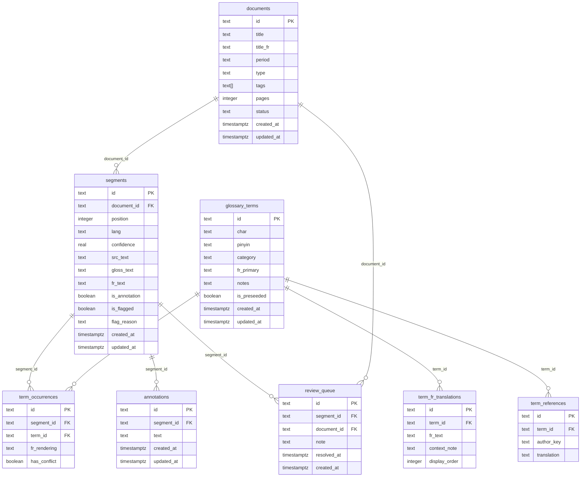

# ClassiMed Translate — Data Model Technical Document

| Field         | Value                                                             |
| ------------- | ----------------------------------------------------------------- |
| Document type | Technical Data Model                                              |
| Version       | 1.0                                                               |
| Date          | May 2026                                                          |
| Application   | ClassiMed Translate — Classical TCM Text Translation & Study Tool |
| Database      | PostgreSQL (via PGLite / @electric-sql/pglite)                    |
| ORM           | Drizzle ORM                                                       |

---

## 1. Conceptual Data Model

The conceptual model identifies the core business entities and their relationships, independent of any implementation technology. It answers: _what information does the system need to manage?_

### Entities

| Entity                   | Responsibility                                                                               |
| ------------------------ | -------------------------------------------------------------------------------------------- |
| **Document**             | A classical text source (e.g. Su Wen ch. 1). The top-level unit of scholarly work.           |
| **Segment**              | A single clause or sentence within a document. The unit of translation and annotation.       |
| **GlossaryTerm**         | A TCM technical term — the primary knowledge asset of the system.                            |
| **FrTranslation**        | One French rendering of a glossary term (multiple allowed per term, with context notes).     |
| **ReferenceTranslation** | How an established author (Larre, Husson…) has translated a term — read-only reference data. |
| **TermOccurrence**       | The resolved link between a segment and a glossary term as it appears in that segment.       |
| **Annotation**           | A margin note written by the user, attached to a segment.                                    |
| **ReviewQueueItem**      | A segment flagged for follow-up review across the corpus.                                    |

### Conceptual ER Diagram

---

## 2. Logical Data Model

The logical model adds attributes, primary keys, foreign keys, and cardinality constraints. It remains database-agnostic but is specific enough to drive schema design.

### 2.1 Document

| Attribute | Type     | Constraints                | Notes                                      |
| --------- | -------- | -------------------------- | ------------------------------------------ |
| id        | String   | PK                         | Slug-style identifier (e.g. `suwen-01`)    |
| title     | String   | NOT NULL                   | Classical Chinese title                    |
| titleFr   | String   | nullable                   | French title or subtitle                   |
| period    | String   | nullable                   | Historical period (e.g. "Han occidentaux") |
| type      | String   | NOT NULL, default `canon`  | `canon`, `manuscript`, `commentary`        |
| tags      | String[] | NOT NULL, default `[]`     | User-defined tags for filtering            |
| pages     | Integer  | NOT NULL, default `0`      | Approximate page count                     |
| status    | String   | NOT NULL, default `active` | `active`, `queued`, `archived`             |
| createdAt | DateTime | NOT NULL                   |                                            |
| updatedAt | DateTime | NOT NULL                   |                                            |

### 2.2 Segment

| Attribute    | Type     | Constraints               | Notes                                              |
| ------------ | -------- | ------------------------- | -------------------------------------------------- |
| id           | String   | PK                        | e.g. `suwen-01-s1`                                 |
| documentId   | String   | FK → Document, NOT NULL   | Cascade delete                                     |
| position     | Integer  | NOT NULL                  | 1-based ordering within document                   |
| lang         | String   | NOT NULL                  | `classical`, `modern`, `french`                    |
| confidence   | Float    | NOT NULL, default `1.0`   | Language-detection confidence [0–1]                |
| srcText      | String   | NOT NULL                  | Column A: original source text                     |
| glossText    | String   | nullable                  | Column B: modern Chinese paraphrase (AI, editable) |
| frText       | String   | nullable                  | Column C: French translation (AI, editable)        |
| isAnnotation | Boolean  | NOT NULL, default `false` | Editorial note, displayed differently              |
| isFlagged    | Boolean  | NOT NULL, default `false` | In the review queue                                |
| flagReason   | String   | nullable                  | User-written reason for flagging                   |
| createdAt    | DateTime | NOT NULL                  |                                                    |
| updatedAt    | DateTime | NOT NULL                  |                                                    |

### 2.3 GlossaryTerm

| Attribute   | Type     | Constraints               | Notes                                                                      |
| ----------- | -------- | ------------------------- | -------------------------------------------------------------------------- |
| id          | String   | PK                        | Slug (e.g. `qi`, `yinyang`)                                                |
| char        | String   | NOT NULL, UNIQUE          | Chinese characters (e.g. 氣)                                               |
| pinyin      | String   | NOT NULL                  | Romanisation with tone marks                                               |
| category    | String   | NOT NULL                  | `concept`, `meridian`, `point`, `pathology`, `technique`, `herb`, `proper` |
| frPrimary   | String   | NOT NULL                  | The user's chosen primary French rendering                                 |
| notes       | String   | nullable                  | Free text: etymology, clinical notes, controversies                        |
| isPreseeded | Boolean  | NOT NULL, default `false` | Marks the ~200 built-in seed terms                                         |
| createdAt   | DateTime | NOT NULL                  |                                                                            |
| updatedAt   | DateTime | NOT NULL                  |                                                                            |

### 2.4 FrTranslation

| Attribute    | Type    | Constraints                 | Notes                                               |
| ------------ | ------- | --------------------------- | --------------------------------------------------- |
| id           | String  | PK                          |                                                     |
| termId       | String  | FK → GlossaryTerm, NOT NULL | Cascade delete                                      |
| frText       | String  | NOT NULL                    | One French rendering (e.g. "souffle")               |
| contextNote  | String  | nullable                    | When to use (e.g. "dans les textes philosophiques") |
| displayOrder | Integer | NOT NULL, default `0`       | Ordering within term entry                          |

### 2.5 ReferenceTranslation

| Attribute   | Type   | Constraints                 | Notes                            |
| ----------- | ------ | --------------------------- | -------------------------------- |
| id          | String | PK                          |                                  |
| termId      | String | FK → GlossaryTerm, NOT NULL | Cascade delete                   |
| authorKey   | String | NOT NULL                    | `Larre`, `Husson`, `Andrès`, …   |
| translation | String | NOT NULL                    | How that author renders the term |

### 2.6 TermOccurrence

| Attribute   | Type    | Constraints                 | Notes                                          |
| ----------- | ------- | --------------------------- | ---------------------------------------------- |
| id          | String  | PK                          |                                                |
| segmentId   | String  | FK → Segment, NOT NULL      | Cascade delete                                 |
| termId      | String  | FK → GlossaryTerm, NOT NULL | Cascade delete                                 |
| frRendering | String  | nullable                    | How the term was actually rendered in column C |
| hasConflict | Boolean | NOT NULL, default `false`   | True when frRendering ≠ term's frPrimary       |

### 2.7 Annotation

| Attribute | Type     | Constraints            | Notes            |
| --------- | -------- | ---------------------- | ---------------- |
| id        | String   | PK                     |                  |
| segmentId | String   | FK → Segment, NOT NULL | Cascade delete   |
| text      | String   | NOT NULL               | Margin note body |
| createdAt | DateTime | NOT NULL               |                  |
| updatedAt | DateTime | NOT NULL               |                  |

### 2.8 ReviewQueueItem

| Attribute  | Type     | Constraints             | Notes                                       |
| ---------- | -------- | ----------------------- | ------------------------------------------- |
| id         | String   | PK                      |                                             |
| segmentId  | String   | FK → Segment, NOT NULL  | Cascade delete                              |
| documentId | String   | FK → Document, NOT NULL | Denormalised for cross-document queue views |
| note       | String   | nullable                | Reason for review                           |
| resolvedAt | DateTime | nullable                | Null = open; set = resolved                 |
| createdAt  | DateTime | NOT NULL                |                                             |

### Logical ER Diagram

---

## 3. Physical Data Model

The physical model maps the logical model to concrete PostgreSQL DDL constructs as expressed through Drizzle ORM (`drizzle-orm/pg-core`). The target runtime is PGLite (in-browser PostgreSQL).

### Type mapping

| Logical type     | PostgreSQL / Drizzle type   | Notes                                                  |
| ---------------- | --------------------------- | ------------------------------------------------------ |
| String (PK/FK)   | `text`                      | Slug or UUID — text avoids SEQUENCE overhead in PGLite |
| String (content) | `text`                      | Unbounded, supports CJK characters via UTF-8           |
| String[]         | `text[]` (`.array()`)       | PostgreSQL native array                                |
| Integer          | `integer`                   |                                                        |
| Float [0–1]      | `real`                      | 4-byte float sufficient for confidence scores          |
| Boolean          | `boolean`                   |                                                        |
| DateTime         | `timestamp with time zone`  | All timestamps stored with TZ                          |
| nullable         | column without `.notNull()` |                                                        |

### Physical ER Diagram

### Index strategy

| Table              | Index                      | Rationale                                  |
| ------------------ | -------------------------- | ------------------------------------------ |
| `segments`         | `(document_id, position)`  | Primary sort order for workspace rendering |
| `segments`         | `(is_flagged)`             | Fast review queue filtering                |
| `term_occurrences` | `(segment_id)`             | Joins in workspace rendering               |
| `term_occurrences` | `(term_id)`                | Corpus occurrences panel in glossary       |
| `term_occurrences` | `(has_conflict)`           | Conflict warning overlay                   |
| `glossary_terms`   | `(char)` UNIQUE            | Term lookup by Chinese characters          |
| `glossary_terms`   | `(category)`               | Glossary filtering by category             |
| `review_queue`     | `(resolved_at)` where NULL | Open-queue view                            |

### Constraint summary

| Table                          | Constraint                              | Type         |
| ------------------------------ | --------------------------------------- | ------------ |
| `segments.document_id`         | → `documents.id` ON DELETE CASCADE      | FK           |
| `term_fr_translations.term_id` | → `glossary_terms.id` ON DELETE CASCADE | FK           |
| `term_references.term_id`      | → `glossary_terms.id` ON DELETE CASCADE | FK           |
| `term_occurrences.segment_id`  | → `segments.id` ON DELETE CASCADE       | FK           |
| `term_occurrences.term_id`     | → `glossary_terms.id` ON DELETE CASCADE | FK           |
| `annotations.segment_id`       | → `segments.id` ON DELETE CASCADE       | FK           |
| `review_queue.segment_id`      | → `segments.id` ON DELETE CASCADE       | FK           |
| `review_queue.document_id`     | → `documents.id` ON DELETE CASCADE      | FK           |
| `glossary_terms.char`          | UNIQUE                                  | Business key |

---

## 4. Design Decisions & Rationale

### Why `text` primary keys?

Slug-style text keys (`suwen-01`, `qi`) make seed data readable and portable without a separate slug column. PGLite has no performance penalty for text PKs in single-user workloads.

### Why separate `term_fr_translations` table?

Each TCM term can have multiple valid French renderings with different contextual usage (e.g. 氣 → _"souffle"_ in philosophical texts, _"qi"_ in clinical). A normalised table avoids array-of-strings columns and allows contextNote per rendering.

### Why denormalise `document_id` in `review_queue`?

The review queue is a cross-document view. Denormalising avoids a join through `segments` on every queue render, and the FK constraint keeps it consistent.

### Why `real` for confidence?

Confidence is always in [0, 1] and 4-byte float precision is sufficient. No decimal arithmetic is performed on it.

### Why cascade deletes everywhere?

ClassiMed is a personal research workspace. When a document is deleted, all its derived data (segments, annotations, queue items) should be removed atomically. There is no audit-log or soft-delete requirement in v1.
