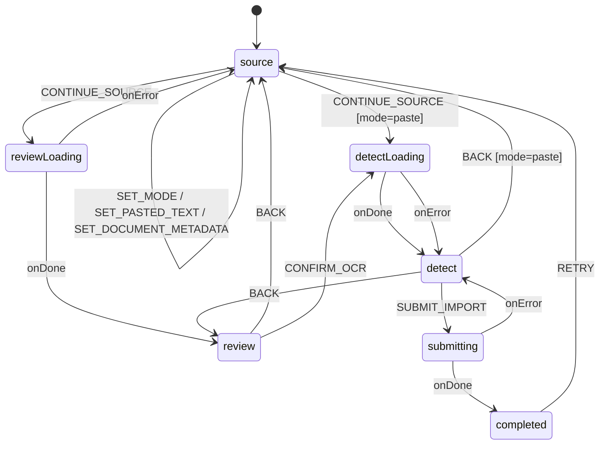

# Import Machine — State Diagram

_Generated from `apps/classimed/src/routes/_classimed/import/-machine.ts`._

```mermaid
stateDiagram-v2
    [*] --> source

    state reviewLoading : invoke runOcr
    state detectLoading : invoke runSegmentation
    state submitting : invoke finalizeImport

    source --> source : SET_MODE / SET_PASTED_TEXT / SET_DOCUMENT_METADATA

    source --> detectLoading : CONTINUE_SOURCE [mode=paste]
    source --> reviewLoading : CONTINUE_SOURCE
    reviewLoading --> review : onDone
    reviewLoading --> source : onError
    review --> source : BACK
    review --> detectLoading : CONFIRM_OCR
    detectLoading --> detect : onDone
    detectLoading --> detect : onError
    detect --> source : BACK [mode=paste]
    detect --> review : BACK
    detect --> submitting : SUBMIT_IMPORT
    submitting --> completed : onDone
    submitting --> detect : onError
    completed --> source : RETRY
```
